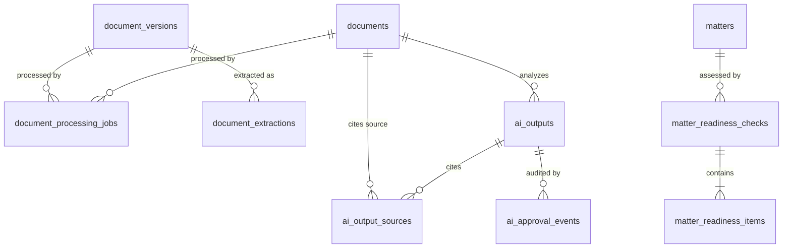

# Phase 3 Database Schema & Migration Plan

This document details the database schemas, indexes, permissions, and Row Level Security (RLS) policies required for the Phase 3 Document Intelligence and AI Matter Readiness features.

---

## 1. Schema Design

We will introduce 7 new tables under the `public` schema. All tables enforce strict multi-tenancy using `firm_id`.



### 1.1 Document Processing Jobs (`public.document_processing_jobs`)
Tracks asynchronous ingestion jobs (e.g. text extraction, OCR).
- `id`: `UUID PRIMARY KEY DEFAULT gen_random_uuid()`
- `firm_id`: `UUID NOT NULL REFERENCES public.firms(id) ON DELETE CASCADE`
- `matter_id`: `UUID NOT NULL REFERENCES public.matters(id) ON DELETE CASCADE`
- `document_id`: `UUID NOT NULL REFERENCES public.documents(id) ON DELETE CASCADE`
- `version_id`: `UUID NOT NULL REFERENCES public.document_versions(id) ON DELETE CASCADE`
- `status`: `VARCHAR(50) NOT NULL` (e.g. `'pending'`, `'processing'`, `'completed'`, `'failed'`)
- `error_message`: `TEXT`
- `created_at`: `TIMESTAMPTZ DEFAULT now() NOT NULL`
- `updated_at`: `TIMESTAMPTZ DEFAULT now() NOT NULL`

### 1.2 Document Extractions (`public.document_extractions`)
Stores extracted raw text safely inside the database to avoid re-extracting binaries.
- `id`: `UUID PRIMARY KEY DEFAULT gen_random_uuid()`
- `firm_id`: `UUID NOT NULL REFERENCES public.firms(id) ON DELETE CASCADE`
- `matter_id`: `UUID NOT NULL REFERENCES public.matters(id) ON DELETE CASCADE`
- `document_id`: `UUID NOT NULL REFERENCES public.documents(id) ON DELETE CASCADE`
- `version_id`: `UUID UNIQUE NOT NULL REFERENCES public.document_versions(id) ON DELETE CASCADE`
- `extracted_text`: `TEXT NOT NULL`
- `created_at`: `TIMESTAMPTZ DEFAULT now() NOT NULL`

### 1.3 AI Outputs (`public.ai_outputs`)
Stores AI-generated document summaries, key fields, and matter briefs.
- `id`: `UUID PRIMARY KEY DEFAULT gen_random_uuid()`
- `firm_id`: `UUID NOT NULL REFERENCES public.firms(id) ON DELETE CASCADE`
- `matter_id`: `UUID NOT NULL REFERENCES public.matters(id) ON DELETE CASCADE`
- `document_id`: `UUID REFERENCES public.documents(id) ON DELETE CASCADE`
- `type`: `VARCHAR(50) NOT NULL` (e.g. `'document_summary'`, `'matter_summary'`, `'readiness_check'`)
- `content`: `JSONB NOT NULL` (contains summary text, extracted key-value pairs)
- `confidence_score`: `NUMERIC(4,3) NOT NULL` (value between `0.000` and `1.000`)
- `missing_information`: `JSONB` (structured array of detected gaps)
- `approval_status`: `VARCHAR(50) DEFAULT 'pending' NOT NULL` (e.g. `'pending'`, `'approved'`, `'rejected'`)
- `approved_by`: `TEXT` (Clerk User ID)
- `approved_at`: `TIMESTAMPTZ`
- `created_at`: `TIMESTAMPTZ DEFAULT now() NOT NULL`
- `updated_at`: `TIMESTAMPTZ DEFAULT now() NOT NULL`

### 1.4 AI Output Sources (`public.ai_output_sources`)
Maintains clear, source-cited provenance for AI outputs.
- `id`: `UUID PRIMARY KEY DEFAULT gen_random_uuid()`
- `firm_id`: `UUID NOT NULL REFERENCES public.firms(id) ON DELETE CASCADE`
- `ai_output_id`: `UUID NOT NULL REFERENCES public.ai_outputs(id) ON DELETE CASCADE`
- `source_document_id`: `UUID NOT NULL REFERENCES public.documents(id) ON DELETE CASCADE`
- `source_version_id`: `UUID NOT NULL REFERENCES public.document_versions(id) ON DELETE CASCADE`
- `quote_text`: `TEXT NOT NULL`
- `page_number`: `INTEGER`
- `created_at`: `TIMESTAMPTZ DEFAULT now() NOT NULL`

### 1.5 Matter Readiness Checks (`public.matter_readiness_checks`)
Evaluates absolute and category scores for legal matter completeness.
- `id`: `UUID PRIMARY KEY DEFAULT gen_random_uuid()`
- `firm_id`: `UUID NOT NULL REFERENCES public.firms(id) ON DELETE CASCADE`
- `matter_id`: `UUID NOT NULL REFERENCES public.matters(id) ON DELETE CASCADE`
- `overall_score`: `NUMERIC(4,3) NOT NULL` (value between `0.000` and `1.000`)
- `checked_at`: `TIMESTAMPTZ DEFAULT now() NOT NULL`

### 1.6 Matter Readiness Items (`public.matter_readiness_items`)
Holds individual item checklist states evaluated under the check.
- `id`: `UUID PRIMARY KEY DEFAULT gen_random_uuid()`
- `firm_id`: `UUID NOT NULL REFERENCES public.firms(id) ON DELETE CASCADE`
- `check_id`: `UUID NOT NULL REFERENCES public.matter_readiness_checks(id) ON DELETE CASCADE`
- `item_name`: `VARCHAR(255) NOT NULL` (e.g. `'FICA Identification'`, `'Summons Served Date'`)
- `is_satisfied`: `BOOLEAN NOT NULL`
- `details`: `TEXT`
- `citation_output_id`: `UUID REFERENCES public.ai_outputs(id) ON DELETE SET NULL`

### 1.7 AI Approval Events (`public.ai_approval_events`)
Audit trail of practitioner actions taken on AI outputs.
- `id`: `UUID PRIMARY KEY DEFAULT gen_random_uuid()`
- `firm_id`: `UUID NOT NULL REFERENCES public.firms(id) ON DELETE CASCADE`
- `ai_output_id`: `UUID NOT NULL REFERENCES public.ai_outputs(id) ON DELETE CASCADE`
- `action`: `VARCHAR(50) NOT NULL` (e.g. `'approved'`, `'rejected'`)
- `performed_by`: `TEXT NOT NULL` (Clerk User ID)
- `rejection_reason`: `TEXT`
- `created_at`: `TIMESTAMPTZ DEFAULT now() NOT NULL`

---

## 2. Row Level Security (RLS) Policy Declarations

To align with multi-tenant requirements, Row Level Security (RLS) is enabled on all tables, and policies enforce tenant isolation via `get_auth_firm_id()`.

```sql
-- Enable RLS on all tables
ALTER TABLE public.document_processing_jobs ENABLE ROW LEVEL SECURITY;
ALTER TABLE public.document_extractions ENABLE ROW LEVEL SECURITY;
ALTER TABLE public.ai_outputs ENABLE ROW LEVEL SECURITY;
ALTER TABLE public.ai_output_sources ENABLE ROW LEVEL SECURITY;
ALTER TABLE public.matter_readiness_checks ENABLE ROW LEVEL SECURITY;
ALTER TABLE public.matter_readiness_items ENABLE ROW LEVEL SECURITY;
ALTER TABLE public.ai_approval_events ENABLE ROW LEVEL SECURITY;

-- Document Processing Jobs Policy
CREATE POLICY "Firm document processing jobs scoping" ON public.document_processing_jobs
  FOR ALL USING (firm_id = get_auth_firm_id());

-- Document Extractions Policy
CREATE POLICY "Firm document extractions scoping" ON public.document_extractions
  FOR ALL USING (firm_id = get_auth_firm_id());

-- AI Outputs Policy
CREATE POLICY "Firm AI outputs scoping" ON public.ai_outputs
  FOR ALL USING (firm_id = get_auth_firm_id());

-- AI Output Sources Policy
CREATE POLICY "Firm AI output sources scoping" ON public.ai_output_sources
  FOR ALL USING (firm_id = get_auth_firm_id());

-- Matter Readiness Checks Policy
CREATE POLICY "Firm matter readiness checks scoping" ON public.matter_readiness_checks
  FOR ALL USING (firm_id = get_auth_firm_id());

-- Matter Readiness Items Policy
CREATE POLICY "Firm matter readiness items scoping" ON public.matter_readiness_items
  FOR ALL USING (firm_id = get_auth_firm_id());

-- AI Approval Events Policy
CREATE POLICY "Firm AI approval events scoping" ON public.ai_approval_events
  FOR ALL USING (firm_id = get_auth_firm_id());
```

---

## 3. Optimizing Indexes & Constraints

We will create indexes to optimize join performance and readiness lookup logic:

```sql
-- Indexes for processing status lookup
CREATE INDEX idx_processing_jobs_firm_status ON public.document_processing_jobs (firm_id, status);
CREATE INDEX idx_processing_jobs_document ON public.document_processing_jobs (document_id);

-- Indexes for summaries and briefs queries
CREATE INDEX idx_ai_outputs_matter_type ON public.ai_outputs (matter_id, type);
CREATE INDEX idx_ai_outputs_document ON public.ai_outputs (document_id);

-- Indexes for citations
CREATE INDEX idx_ai_sources_output ON public.ai_output_sources (ai_output_id);

-- Indexes for readiness score telemetry
CREATE INDEX idx_readiness_checks_matter ON public.matter_readiness_checks (matter_id);
```

---

## 4. Granting Database Roles Permissions

```sql
GRANT ALL ON TABLE public.document_processing_jobs TO postgres, service_role, authenticated;
GRANT SELECT ON TABLE public.document_processing_jobs TO anon;

GRANT ALL ON TABLE public.document_extractions TO postgres, service_role, authenticated;

GRANT ALL ON TABLE public.ai_outputs TO postgres, service_role, authenticated;
GRANT SELECT ON TABLE public.ai_outputs TO anon;

GRANT ALL ON TABLE public.ai_output_sources TO postgres, service_role, authenticated;
GRANT SELECT ON TABLE public.ai_output_sources TO anon;

GRANT ALL ON TABLE public.matter_readiness_checks TO postgres, service_role, authenticated;
GRANT SELECT ON TABLE public.matter_readiness_checks TO anon;

GRANT ALL ON TABLE public.matter_readiness_items TO postgres, service_role, authenticated;
GRANT SELECT ON TABLE public.matter_readiness_items TO anon;

GRANT ALL ON TABLE public.ai_approval_events TO postgres, service_role, authenticated;
```
